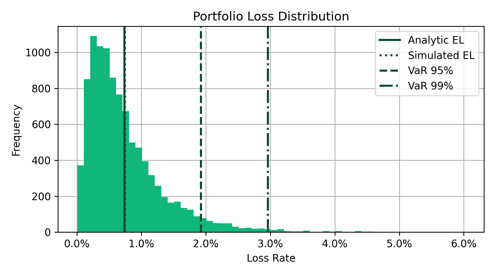

# Introduction

When a bank lends money, it faces the risk that some borrowers will default — that is, fail to repay. For any individual loan, this is straightforward to reason about. The challenge arises at the portfolio level: when the economy turns, many borrowers tend to default at the same time, and it is this clustering of defaults that drives large losses.

The goal of this task is to build a Monte Carlo engine that simulates the distribution of losses a bank might expect to take on a portfolio of loans over a given time horizon. Rather than asking "what is the single expected loss?", we want to characterise the full distribution, including the tail, where large, correlated losses concentrate.

## Asset Return Model

The foundation of the model is the assumption that each borrower (obligor) $i$ has a latent asset return, $X_i$, which determines whether they default. We decompose this into a systematic component, shared across obligors, and an idiosyncratic component, unique to each obligor:

$$
X_i = \phi_i \sqrt{RSQ_i} + \varepsilon_i\sqrt{1 - RSQ_i}
$$

where:

- $\phi_i \sim N(0,1)$ is the **systematic factor** — a shock correlated across obligors, representing economy-wide or sector-wide events such as a recession or a rise in interest rates.
- $\varepsilon_i \sim N(0,1)$ is the **idiosyncratic factor** — a shock specific to obligor $i$, such as a fraud event or a key customer relationship breaking down.
- $RSQ_i \in [0, 1]$ controls the relative weight of each. An obligor with $RSQ_i = 1$ is entirely driven by the systematic factor; one with $RSQ_i = 0$ is entirely idiosyncratic.

The $\sqrt{RSQ_i}$ and $\sqrt{1 - RSQ_i}$ scaling ensures that $X_i$ remains standard normal regardless of $RSQ_i$, which you can verify by computing $\text{Var}(X_i)$.

## Default Mechanism

An obligor is assumed to default when their asset return falls below a threshold $d_i$, calibrated so that the unconditional probability of default matches their assigned PD:

$$
P(X_i \leq d_i) = PD_i \implies d_i = N^{-1}(PD_i)
$$

where $N^{-1}$ is the inverse standard normal CDF (also called the probit function).

## Systematic Factor Structure

In this stylised model, each obligor's systematic factor $\phi_i$ is driven by two components: a **region** (US or UK) and a **sector** (Commercial Real Estate, Corporate, or Financial Institutions). These five factors are correlated with one another, and it is this correlation structure that causes obligors to default together under adverse conditions.

We are provided with a historical time series of shocks to each of these five factors. We use the empirical covariance of these shocks to construct a correlated factor model via a Cholesky decomposition, which we will cover in detail in the implementation section.

## Loss Calculation

When an obligor defaults, the loss to the bank is not necessarily the full amount lent. The loss on obligor $i$ is:

$$
\text{Loss}_i = EAD_i \times LGD_i \times \mathbf{1}[X_i \leq d_i]
$$

where $EAD_i$ (Exposure at Default) is the outstanding loan balance and $LGD_i$ (Loss Given Default) is the fraction of that balance the bank expects to lose. The total portfolio loss in a given scenario is simply the sum across all obligors.

By simulating many thousands of scenarios, each with a different draw of systematic and idiosyncratic shocks, we build up a full loss distribution from which we can compute risk measures such as Value at Risk (VaR) and Expected Shortfall (ES).

---

# Data

## Systematic Shocks

We are provided with a quarterly time series of systematic factor shocks across the five factors. These are standard normal by construction and their covariance matrix encodes how the factors move together.

```{python}
import pandas as pd

systematic_shocks = pd.read_csv('data/systematic_shocks.csv', index_col='Quarter')
systematic_shocks.head()
```

## Loan Book

An example loan book of 50,000 loans is provided, with the following fields:

| Column          | Description                                                                    |
|-----------------|--------------------------------------------------------------------------------|
| `ead`           | Exposure at Default — the outstanding loan balance                             |
| `lgd`           | Loss Given Default — the fraction of EAD lost if the obligor defaults          |
| `rsq`           | The proportion of the obligor's asset return driven by their systematic factor |
| `sector`        | The sector systematic factor for this obligor                                  |
| `region`        | The region systematic factor for this obligor                                  |
| `credit_rating` | Used to look up the obligor's PD from the mapping below                        |

```{python}
loan_book = pd.read_csv('data/loan_book.csv', index_col='loan_id')
loan_book.head()
```

## PD Mapping

Credit ratings (e.g. AAA, BB) are mapped to a numeric probability of default. This mapping is merged onto the loan book before simulation to produce a PD for each obligor.

```{python}
pd_mapping = pd.read_csv('data/pd_mapping.csv', index_col='Credit Rating')
pd_mapping
```

---

# Implementation

## Preparation

Before running any simulations, two data preparation steps are needed.

First, merge the PD mapping onto the loan book so that every obligor has a numeric probability of default.

Second, compute the empirical covariance matrix from the systematic shocks time series. This matrix $\Sigma$ encodes how the five factors move together and is the basis for all correlated factor draws in the simulation.

## Cholesky Decomposition

To draw correlated factor shocks, we need to decompose the covariance matrix $\Sigma$ using the Cholesky decomposition:

$$
\Sigma = CC^\top
$$

where $C$ is a lower triangular matrix. This plays the same role as a square root for matrices — it lets us transform independent standard normal draws into draws with the correct correlation structure.

In practice, empirical covariance matrices are sometimes not quite positive definite due to numerical noise. Before computing the Cholesky decomposition, ensure $\Sigma$ is positive definite by adding a small value $\epsilon$ to the diagonal:

$$
\Sigma \leftarrow \frac{\Sigma + \Sigma^\top}{2} + \max(0, -\lambda_{\min} + \epsilon) \cdot I
$$

where $\lambda_{\min}$ is the smallest eigenvalue of $\Sigma$. This nudges any near-zero or slightly negative eigenvalues to be strictly positive.

## Factor Loadings

Each obligor maps onto two of the five systematic factors — one for their region and one for their sector. We represent this as a binary loading matrix $F$ of shape $(M \times N)$, where $M$ is the number of obligors and $N$ is the number of factors. Each row $i$ has a 1 in the column corresponding to obligor $i$'s region, and a 1 in the column corresponding to their sector, with zeros elsewhere.

To account for the Cholesky decomposition, we compute the effective loading matrix:

$$
\hat{F} = \text{row-normalise}(FC)
$$

Row-normalising ensures that each obligor's systematic factor $\phi_i$ remains unit variance, regardless of how many factors load into it.

## Simulating Systematic Factors

Given $\hat{F}$ and the Cholesky factor $C$, we draw $N$ independent standard normal factor shocks $Z \sim N(0, I)$ and map them into obligor-level systematic shocks:

$$
\boldsymbol{\phi} = \hat{F}Z
$$

Each element $\phi_i$ is a linear combination of the underlying factor shocks, weighted by obligor $i$'s (normalised) loadings onto those factors.

## Simulating Asset Returns

For each obligor we then draw an idiosyncratic shock $\varepsilon_i \sim N(0,1)$, independent across obligors, and combine with the systematic component:

$$
X_i = \phi_i\sqrt{RSQ_i} + \varepsilon_i\sqrt{1 - RSQ_i}
$$

## Determining Defaults

Obligor $i$ defaults in a scenario if their asset return falls below their PD-implied threshold:

$$
\mathbf{1}[\text{default}_i] = \mathbf{1}\left[X_i \leq N^{-1}(PD_i)\right]
$$

The thresholds $N^{-1}(PD_i)$ are fixed for a given portfolio and can be computed once before the simulation loop.

## Computing Portfolio Loss

The total portfolio loss in a single scenario is:

$$
L = \sum_{i=1}^{M} EAD_i \times LGD_i \times \mathbf{1}[\text{default}_i]
$$

## Running the Full Simulation

The steps above describe a single scenario. Wrap them in a loop over $S$ scenarios to build up a loss vector $\mathbf{L} \in \mathbb{R}^S$. For efficiency, vectorise across obligors — keep the loop over scenarios only.

## Risk Measures

Once you have the full loss vector $\mathbf{L}$, two standard risk measures can be computed.

**Value at Risk** at confidence level $\alpha$ is the $\alpha$-quantile of the loss distribution:

$$
\text{VaR}_\alpha = \inf\{l : P(L \leq l) \geq \alpha\}
$$

**Expected Shortfall** at confidence level $\alpha$ is the mean loss conditional on exceeding $\text{VaR}_\alpha$:

$$
\text{ES}_\alpha = E\left[L \mid L \geq \text{VaR}_\alpha\right]
$$

## Visualisation

Finally, plot the simulated loss distribution as a histogram of loss rates (loss as a fraction of total EAD). Overlay vertical lines for the simulated mean loss, and your VaR estimates.

With 10,000 simulations, the portfolio loss distribution should look something like this:

{width=80%}

| Metric | Value |
|--------|-------|
|Analytic EL | 0.736% |
|Simulated EL | 0.745% |
|VaR (99%) | 2.96% |
|VaR (95%) | 1.92% |
|Expected Shortfall (99%) | 3.72% |

As a sense check, the analytic expected loss,

$$
EL_{\text{portfolio}} = \sum_{i=1}^{M} EAD_i \times LGD_i \times PD_i
$$

should coincide with the simulated mean loss (the mean of $\mathbf{L}$ divided by total EAD). This follows from linearity of expectation — the expected portfolio loss is simply the sum of each obligor's individual expected loss. If your simulated mean diverges noticeably from this analytic value, something has gone wrong upstream. With a greater number of simulations, these two metrics should converge.